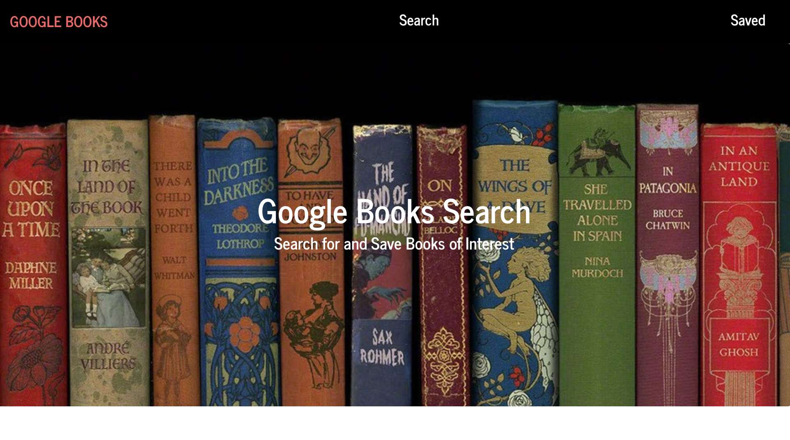
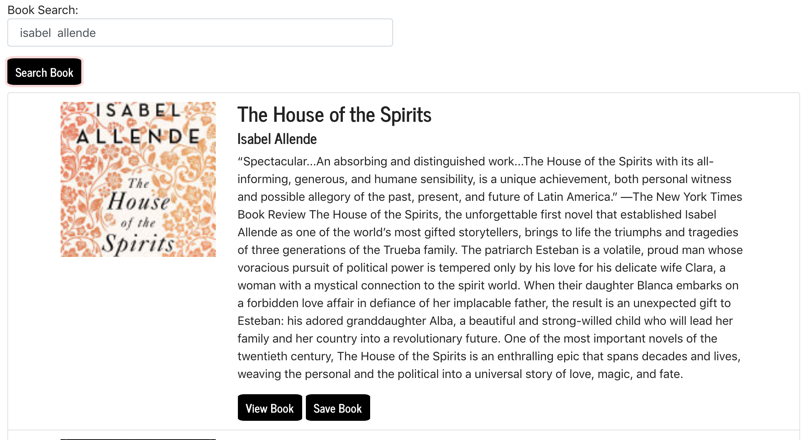

# React Google Book Search
A React-based Google Books Search that displays books on user searches. Search for books using the Google Books API by typing in a title and clicking on "Search". The user can view the book which will bring them to the page on Google Books by clicking "View" in the results for the search. Future update will be working on the "Save Book" button to save the book to the database.

## Packages Setup
1. npm init => initialize package.json
2. npm install => create package-lock.json
3. npm i monggose => install **[mongoose package](https://www.npmjs.com/package/mongoose)**
4. npm i axios => install **[axios package](https://www.npmjs.com/package/axios)**
5. npm i react-router-dom => install **[react-router-dom package](https://www.npmjs.com/package/dotenv)**
6. react-toastify


## Database
1. Connect to a MongoDB database named googlebooks using the mongoose npm package.
2. Using mongoose, create a Book schema.
3. Books should have each of the following fields:
>- Title - Title of the book from the Google Books API
>- Authors - The books's author(s) as returned from the Google Books API
>- Description - The book's description as returned from the Google Books API
>- Image - The Book's thumbnail image as returned from the Google Books API
>- Link - The Book's information link as returned from the Google Books API

4. Example JSON:

>- Authors: ["Isabel Allende"]
>- Description: "The House of The Spirits.
>- Spectacular...An absorbing and distinguished work...The House of the Spirits with its all-informing, generous, and humane  >- Sensibility, is a unique achievement, both personal witness and possible allegory of the past, present, and future of Latin America.” —The New York Times"
>- Image: "https://www.isabelallende.com/en/book/house"
>- Link: "https://books.google.com/booksid=EbypCgAAQBAJ&printsec=frontcover&dq=isabel++allende&hl=&cd=1&source=gbs_api#v=onepage&q=isabel%20%20allende&f=false"
> Title: "The House of The Spirits"





 
## Technologies Implemented

>- MVC design pattern: Model, View, Controller.


- MongoDB
- Express
- React
- Node.JS
- Search for books using Google Books API
``` ruby
   getBook: function (query) {
    return axios.get(`https://www.googleapis.com/books/v1/volumes?q=${query}`);
  },
  // Delete book with the given id
  deleteBook: function (id) {
    return axios.delete("/api/books/" + id).then(result => result.data);
  },
  // Save book to the database
  saveBook: function (bookData) {
    return axios.post("/api/books", bookData).then(result => result.data);
  },
  // Get saved books from the database
  savedBooks: function () {
    return axios.get("/api/books").then(result => result.data);
  }

```

## Prerequisites

>- Node.js - Download the latest version of Node(https://nodejs.org/en/)

>- Created a Mongo Database called "google Book".

## Built With

- Visual Studio Code - Text Editor
- MongoDB
- Terminal/Gitbash

# Author

>-  **[Angel-Cochachez](https://github.com/codifyme/google-books-search)**. MERN Stack Developer
@codifyme:+1 :shipit:
>- Happy Book Searching!
